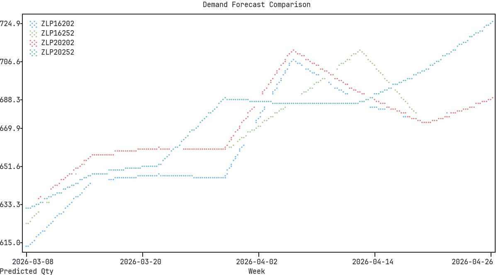

# Quickbooks Product Demand Forecasting



## Ingest
Collect reports from Quickbooks
  Export 1: Sales by Item Detail (this is the big one)

  1. Go to Reports > Sales > Sales by Item Detail
  2. Set the date range to as far back as you have data
  — more history = better seasonality detection
  3. Click Customize Report and make sure these columns
  are checked:
    - Type
    - Date
    - Num (invoice number)
    - Name (customer)
    - Item
    - Qty
    - Sales Price
    - Amount
    - Balance
  4. Click OK to apply
  5. Click Excel (top of report) > Create New Worksheet
  6. Save the Excel file, then re-save as CSV into
  data/raw/

  Export 2: Item List (your SKU catalog)

  1. Go to Reports > List > Item Listing (or Lists >
  Item List)
  2. Click Excel > Create New Worksheet
  3. Save as CSV into data/raw/

  This gives you the item descriptions, types, and any
  SKU codes tied to your products.

  Export 3 (optional): Customer List

  1. Reports > List > Customer Contact List
  2. Export same way — useful later if you want
  customer-segment features

Place the CSVs in the data/raw/ folder

## Data Pipeline

Once the raw CSVs are in place, run the full pipeline:

```
make pipeline
```

This runs four steps in sequence:
1. **Ingest** — parses the QuickBooks grouped report format, extracts transaction rows, cleans dates/quantities, and extracts SKU codes
2. **Features** — aggregates transactions into weekly demand per SKU, then builds lag features (1-4 weeks), rolling stats (4w and 12w windows), calendar/seasonality encodings, and SKU-level profile stats
3. **Validate** — runs 15 data quality checks (null dates, value ranges, duplicate detection, feature completeness)
4. **Load DB** — writes processed data to PostgreSQL

## Model Training

Three models are trained and compared:

### Baseline: Linear Regression
Simple linear regression on the feature set. Provides a floor for comparison.

### Baseline: XGBoost
Gradient-boosted trees with 200 estimators. Best MAE of the three models — strong at predicting typical weekly demand.

### Primary: LSTM
PyTorch LSTM sequence model. Takes sliding windows of 8 weeks of features per SKU and predicts the next week's order quantity. Trains on GPU (RTX 4070) with CUDA.

### Running

```
make train      # train all three models, log to MLflow
make evaluate   # compare runs, promote best to model registry
```

All runs are logged to the MLflow tracking server on the Kubernetes cluster at http://192.168.2.202 with parameters, metrics (MAE, RMSE, MAPE), and model artifacts.

### Results

| Model | MAE | RMSE | MAPE |
|---|---|---|---|
| XGBoost | 0.59 | 10.42 | 380.7% |
| Linear Regression | 1.04 | 5.32 | 325.2% |
| LSTM | 1.21 | 5.90 | 110.0% |

MAPE is inflated because most SKU-weeks have zero demand. MAE is the primary comparison metric. The best model (by MAE) is automatically promoted to the MLflow Model Registry with a `staging` alias.

## Model Serving

A FastAPI app that pulls the promoted model from MLflow and queries PostgreSQL for features at inference time.

### Running

```
make serve              # start on port 8000
PORT=8001 make serve    # use a different port
```

On startup, the app downloads the `staging` model from the MLflow registry and connects to PostgreSQL.

### Endpoints

- **`GET /health`** — status check with model info
- **`POST /predict`** — predict demand for a single SKU
  ```
  curl -X POST http://localhost:8000/predict \
    -H 'Content-Type: application/json' \
    -d '{"sku": "HVP-24242XM"}'
  ```
- **`POST /predict/batch`** — predict demand for multiple SKUs
  ```
  curl -X POST http://localhost:8000/predict/batch \
    -H 'Content-Type: application/json' \
    -d '{"skus": ["HVP-24242XM", "MP13-16252"]}'
  ```
- **`POST /predict/forecast`** — recursive multi-week forecast for a SKU (1-52 weeks)
  ```
  curl -X POST http://localhost:8000/predict/forecast \
    -H 'Content-Type: application/json' \
    -d '{"sku": "HVP-24242XM", "weeks": 12}'
  ```
- **`GET /skus`** — list all SKUs with available features

### Forecast CLI

Plot demand forecasts in the terminal while the serving API is running:

```
make forecast ARGS="HVP-24242XM"                              # single SKU, 12 weeks
make forecast ARGS="HVP-24242XM --weeks 52"                   # full year forecast
make forecast ARGS="HVP-24242XM HVP-20202XM M11-24242"        # compare multiple SKUs
make forecast ARGS="HVP-24242XM --weeks 52 --url http://localhost:8001"  # custom port
```
